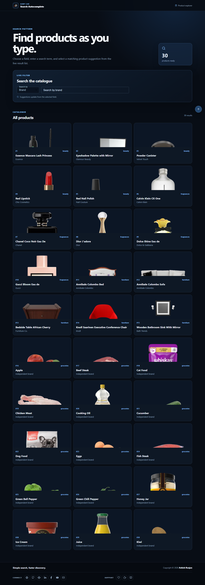

# Search Autocomplete

A responsive React product explorer with field-based search suggestions.

## Features

- Fetches products from DummyJSON
- Search by brand, category, or title
- Selectable autocomplete suggestions with clear search control
- Responsive product cards with loading and empty states
- Fixed branded header, floating go-top control, and icon-only footer links

## Tech stack

React, Create React App, JavaScript, Material UI, Axios, Sass, and react-icons.

## Run locally

```bash
npm install
npm start
```

Create a production build with `npm run build`. Deploy with `npm run deploy`.

## Live

[Open Search Autocomplete](https://a2rp.github.io/search-autocomplete/)



## Links

- [Portfolio](https://www.ashishranjan.net/)
- [GitHub](https://github.com/a2rp)
- [CodePen](https://codepen.io/ash1198)
- [LinkedIn](https://www.linkedin.com/in/aashishranjan)
- [Facebook](https://www.facebook.com/theash.ashish/)
- [YouTube](https://www.youtube.com/@ashishranjan-ashz?sub_confirmation=1)
- [Email](mailto:ash.ranjan09@gmail.com)

## Support

- [Support](https://a2rp-donation-page.netlify.app/)
- [Buy Me a Coffee](https://buymeacoffee.com/a2rp)
- [Patreon](https://patreon.com/a2rp)
